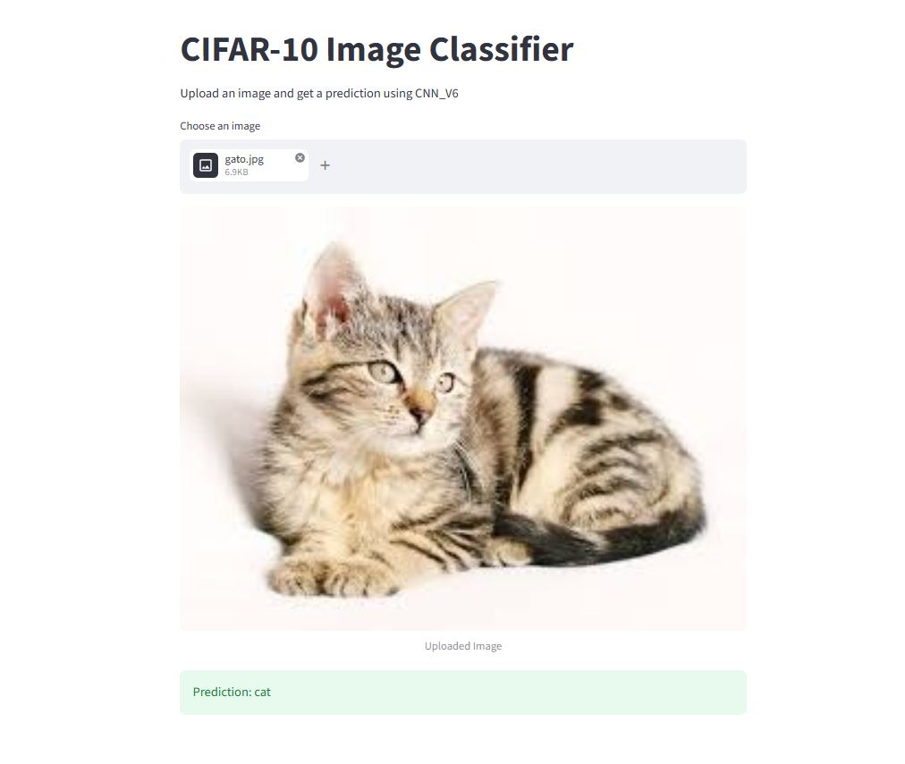

# 🧠 CIFAR-10 Machine Learning Engineering System


---

<p align="center">
  
</p>

---

## 🚀 Project Overview (PORTFOLIO STORYTELLING)

This project implements a complete Machine Learning Engineering system for CIFAR-10 image classification, designed with a strong focus on modularity, reproducibility, and production readiness.

Instead of focusing solely on model training, the system was engineered as an end-to-end pipeline that separates concerns across training, model versioning, inference, and deployment.

The architecture enables multiple CNN experiments (CNN_V1 → CNN_V6), tracks performance using MLflow, and promotes the best-performing model into a production-ready artifact. This model is then served through a FastAPI backend and an interactive Streamlit interface, fully containerized using Docker.

The project simulates a real-world ML production environment where models are not just trained, but deployed as scalable services.

Instead of focusing only on model training, the system is designed as an end-to-end ML pipeline including:

- Model development (CNN_V1 → CNN_V6)
- Experiment tracking (MLflow)
- Model versioning and selection
- Production inference pipeline
- REST API deployment (FastAPI)
- Interactive UI (Streamlit)
- Containerized deployment (Docker)

The system simulates a real-world ML production environment where models are trained, tracked, selected, and deployed as services.

---

## 🏗️ Architecture

The system is designed as a modular ML pipeline:

```
flowchart LR
A[Dataset CIFAR-10] --> B[Data Loader]
B --> C[Training Pipeline]
C --> D[MLflow Tracking]
C --> E[Model Registry]
E --> F[Best Model Artifact]

F --> G[Inference Layer]
G --> H[FastAPI Service]
G --> I[Streamlit UI]

H --> J[User Image Upload]
I --> J
J --> G
```

## 🧩 Project Structure
```
Cifar_10_Computer_Vision_Project_System/
│
├── app/
│   ├── fastapi_app.py
│   └── streamlit_app.py
│
├── src/
│   ├── train.py
│   ├── models.py
│   ├── inference.py
│   ├── production_inference.py
│   ├── data_loader.py
│   ├── model_registry.py
│   └── save_best_model.py
│
├── models/
│   └── best_model.pt
│
├── notebooks/
│
├── Dockerfile
├── Dockerfile.streamlit
├── requirements.txt
└── README.md
```
## 🎯 Key Engineering Contributions

- Designed a modular ML system separating training, inference, and deployment
- Implemented model versioning through a custom model registry
- Built a production-grade inference pipeline reusable across API and UI layers
- Integrated MLflow for experiment tracking and model selection
- Developed REST API using FastAPI for real-time inference
- Created interactive UI using Streamlit
- Containerized the full system using Docker

## 🔬 What This Project Demonstrates
- End-to-end ML system design
- Separation of training and inference logic
- Model versioning strategy
- Production-ready API deployment
- UI integration with Streamlit
- Docker-based containerization
- MLflow experiment tracking


## 🧠 Model Development

Multiple CNN architectures were developed and evaluated:

- CNN_V1 → baseline model
- CNN_V2–V5 → incremental improvements
- CNN_V6 → best-performing production model

All experiments were tracked using MLflow.

##  🔬  Machine Learning Pipeline
- Data preprocessing
- CNN training
- Experiment tracking (MLflow)
- Best model selection
- Export to production artifact
- Deployment via API + UI

# 🌐 Deployment

## ⚡ FastAPI Inference Service
- uvicorn app.fastapi_app:app --reload
- Endpoint: /predict
- Accepts image upload
- Returns predicted class

## 🎨 Streamlit UI
- streamlit run app/streamlit_app.py
- Interactive interface for real-time predictions.

## 🐳 Docker Deployment
- docker build -t cifar10-api .
- docker run -p 8000:8000 cifar10-api
- docker build -f Dockerfile.streamlit -t cifar10-streamlit .
- docker run -p 8501:8501 cifar10-streamlit

## 📊 Key Features
- Modular ML architecture
- Multiple CNN experiments (V1–V6)
- Model registry system
- Production inference pipeline
- REST API + Web UI
- Dockerized deployment
- MLflow experiment tracking

## 🎯 Key Learning Outcomes
- End-to-end ML system design
- Separation of training and inference
- Model versioning strategy
- API deployment with FastAPI
- UI integration with Streamlit
- Containerization with Docker
- Production-style ML architecture

## 🚀 Future Improvements

- CI/CD pipeline (GitHub Actions)
- Kubernetes deployment
- Cloud deployment (AWS / Azure)
- Model monitoring system

## ⚙️ How to Run the Project

### 1️⃣ Clone the repository

```
git clone https://github.com/Javier-DataScience/CIFAR-10-Machine-Learning-Engineering-System.git
cd CIFAR-10-Machine-Learning-Engineering-System
```

### 2️⃣ Create virtual environment (optional but recommended)

- python -m venv venv
- source venv/bin/activate   # Mac/Linux
- venv\Scripts\activate      # Windows

### 3️⃣ Install dependencies

- pip install -r requirements.txt

### 4️⃣ Run FastAPI service

- uvicorn app.fastapi_app:app --reload
- Open in browser:
- http://127.0.0.1:8000/docs

### 5️⃣ Run Streamlit app

- streamlit run app/streamlit_app.py
- Then open in your browser:
- http://localhost:8501

### 6️⃣ Run with Docker (optional)

- FastAPI
- docker build -t cifar10-api .
- docker run -p 8000:8000 cifar10-api
- Streamlit
- docker build -f Dockerfile.streamlit -t cifar10-streamlit .
- docker run -p 8501:8501 cifar10-streamlit

## 👨‍💻 Author

**AI/ML Engineering Learning Project by Alvaro Vega**

Machine Learning Engineering Project
Built for portfolio and production-style demonstration

🎯 **Project Purpose:** Built as a hands-on end-to-end Machine Learning Engineering system to demonstrate model training, versioning, and production deployment using FastAPI, Streamlit, MLflow, and Docker.

Aspiring AI Engineer | Machine Learning Engineer | NLP & LLM Systems

🔗 GitHub: https://github.com/Javier-DataScience

